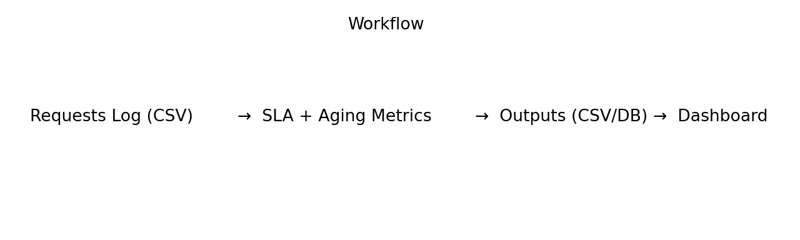
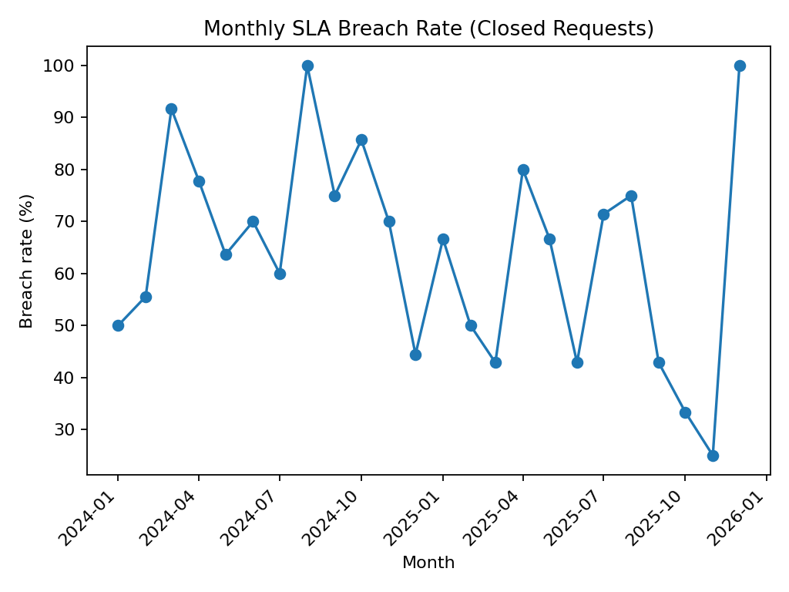
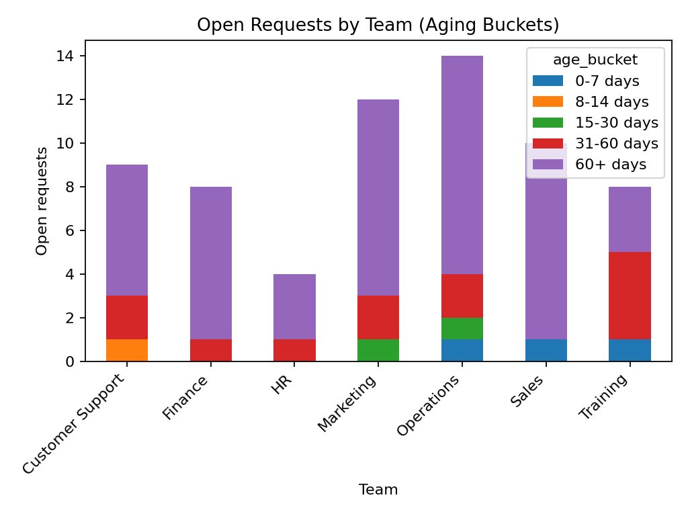
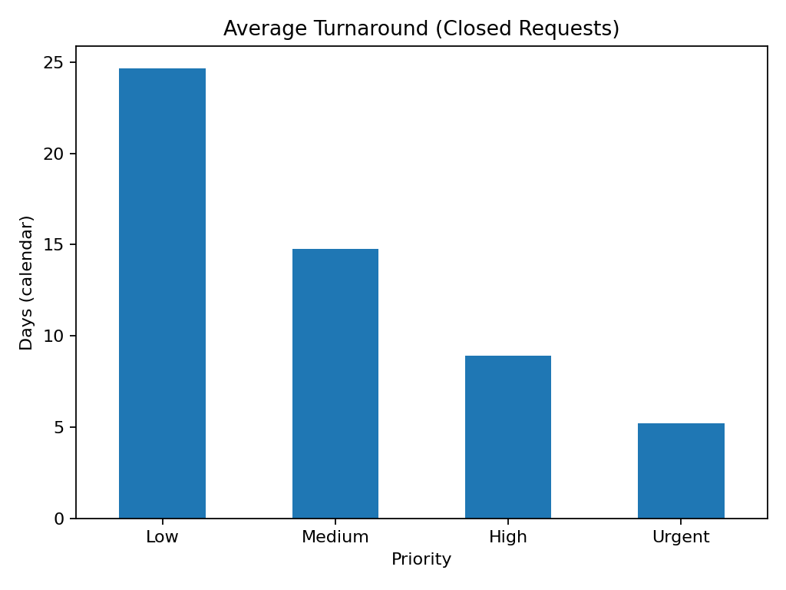

# stakeholder-request-tracker
# Stakeholder Data Request Tracker & SLA Dashboard (Excel + SQL + Python)

This project simulates a **real junior analyst workflow**: handling inbound data/report requests from multiple teams, tracking progress, and reporting on **turnaround time, backlog, and SLA breaches**.

It’s designed to show the responsibilities mentioned in many Junior Data Analyst roles:
- supporting internal stakeholders with data requests
- managing multiple tasks and deadlines
- creating KPI reporting on operational performance (SLA, turnaround, backlog)
- improving reporting workflows with standardised outputs

> ✅ Data in this repo is **synthetic** (safe to publish).

---

## Screenshots






---

## Business Question

How can we track incoming data/report requests and provide a simple performance view for:
- current backlog (and how old the open requests are)
- turnaround time (how long requests take to complete)
- SLA breach rate by team and priority
…so the business can plan capacity and improve service levels?

---

## What I delivered

- A request log dataset (`data/raw/requests.csv`)
- A Python pipeline that:
  - enriches requests with age/turnaround, SLA targets, breach flags
  - creates summary KPI outputs for reporting
  - generates simple charts usable in a dashboard/report
- Outputs for Excel/Power BI:
  - `outputs/requests_enriched.csv`
  - `outputs/sla_summary.csv`
  - `outputs/team_sla_metrics.csv`
  - `outputs/backlog_age_buckets.csv`
  - `outputs/monthly_breach_rate.csv`
- Optional SQL schema + queries for teams that prefer SQL-based reporting

---

## Key checks / assumptions

- SLA targets are defined in business days:
  - Urgent = 2, High = 5, Medium = 10, Low = 15
- A request is **breached** if `completed_date > due_date` (closed requests only).
- Backlog aging uses calendar days (for easy interpretation in Excel/Power BI).
- This is a tracking/reporting project — the goal is to show clean, consistent reporting outputs.

---

## How to run (local)

### 1) Install
```bash
pip install -r python/requirements.txt
```

### 2) Run generation + metrics
```bash
python python/generate_requests_and_metrics.py
```

### 3) Open outputs
- Open `outputs/requests_enriched.csv` in Excel
- Use `outputs/*.csv` as Power BI sources (or load into SQL)
- Charts are saved to `images/`

---

## Repo structure

```text
04-stakeholder-request-tracker/
  data/
    raw/
      requests.csv
  python/
    generate_requests_and_metrics.py
    requirements.txt
  sql/
    00_schema.sql
    10_metrics_queries.sql
  outputs/
    requests_enriched.csv
    sla_summary.csv
    team_sla_metrics.csv
    backlog_age_buckets.csv
    monthly_breach_rate.csv
  images/
    workflow.png
    sla_breach_rate.png
    backlog_by_team.png
    avg_turnaround_by_priority.png
```

---

